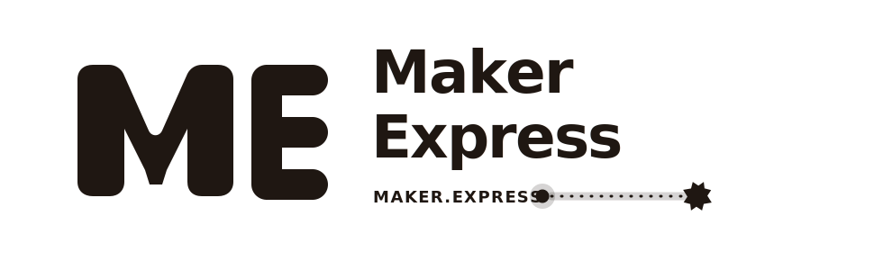

<div align="center">

<picture>
  <source media="(prefers-color-scheme: dark)" srcset="assets/brand/maker-express/logo-single-light.svg">
  
</picture>
&nbsp;&nbsp;&nbsp;
<picture>
  <source media="(prefers-color-scheme: dark)" srcset="assets/brand/hardstack/logo-single-light.svg">
  
</picture>

# Maker Express + Hardstack Open Core

One platform, two brands, one shared data + MCP + skills core.

[](LICENSE)
[](mcp/)
[](skills/)
[](CONTRIBUTING.md)

[Resources](resources/) · [Funding](funding/) · [MCP](mcp/) · [Skills](skills/) · [Docs](docs/README.md) · [Roadmap](ROADMAP.md) · [Contribute](#contributing)

</div>

```text
M A K E R . E X P R E S S   ×   H A R D S T A C K
Discover | Build | Ship
```

## What This Repo Delivers

- high-signal hardware ecosystem data (labs, vendors, services, grants, investors)
- MCP server package for tool-compatible retrieval
- reusable skills for repeatable maker workflows
- contributor validators + tests for quality control

Private runtime/admin/deploy internals live in [Maker-Express/Main](https://github.com/Maker-Express/Main) (private).

## Dual-Brand Runtime Model

| Brand | URL | Positioning | Backend/Data |
|---|---|---|---|
| Maker Express | [maker.express](https://maker.express) | broad builder discovery + action | shared |
| Hardstack | [hardstack.xyz](https://hardstack.xyz) | hardtech-oriented front door | shared |

Branding differs. Core platform remains the same.

## MCP + Skills

This repo is agent-first by design:

- [mcp/README.md](mcp/README.md): protocol layer + setup
- [skills/README.md](skills/README.md): reusable workflows
- [AGENT_CONTRIBUTING.md](AGENT_CONTRIBUTING.md): agent contribution contract

## Start Fast

```bash
git clone https://github.com/Maker-Express/Maker-Express.git
cd Maker-Express
python3 scripts/validate_md.py resources/
python3 scripts/check_skills.py
```

MCP package build:

```bash
cd mcp
npm install
npm run build
```

## Documentation

- [Documentation Index](docs/README.md)
- [Repository Structure](docs/repository-structure.md)
- [Data Model](docs/data-model.md)
- [Skills Verification Boundary](docs/skills-verification-boundary.md)

## Contributing

Read:

- [CONTRIBUTING.md](CONTRIBUTING.md)
- [AGENT_CONTRIBUTING.md](AGENT_CONTRIBUTING.md)

Quality bar:

1. source-backed entries only
2. no placeholders
3. consistent taxonomy and slugs
4. validators/tests passing before PR

## Platform Links

- Maker Express: [https://maker.express](https://maker.express)
- Hardstack: [https://hardstack.xyz](https://hardstack.xyz)
- Sponsor: [https://samaritan.bio](https://samaritan.bio)
- Sponsor: [https://mekuva.com](https://mekuva.com)

## License

- Data: [CC BY 4.0](LICENSE)
- Code/scripts: package-level licensing as documented

<div align="center">

Built for makers, operators, and agent workflows.

</div>
