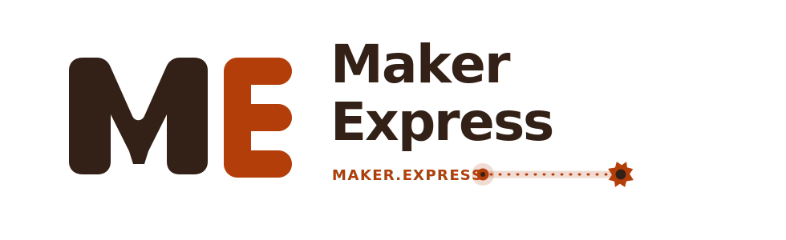

<div align="center">


&nbsp;&nbsp;&nbsp;&nbsp;


# Maker Express + Hardstack Open Core

One platform. Two brand front doors. Same data plane, same MCP layer, same skills system.

[](LICENSE)
[](mcp/)
[](skills/)
[](CONTRIBUTING.md)

[Resources](resources/) · [Funding](funding/) · [MCP](mcp/) · [Skills](skills/) · [Docs](docs/README.md) · [Roadmap](ROADMAP.md) · [Contribute](#contributing)

</div>

```text
███    ███  █████  ██   ██ ███████ ██████      ███████ ██   ██ ██████  ██████  ███████ ███████ ███████
████  ████ ██   ██ ██  ██  ██      ██   ██     ██       ██ ██  ██   ██ ██   ██ ██      ██      ██
██ ████ ██ ███████ █████   █████   ██████      █████     ███   ██████  ██████  █████   ███████ ███████
██  ██  ██ ██   ██ ██  ██  ██      ██   ██     ██       ██ ██  ██      ██   ██ ██           ██      ██
██      ██ ██   ██ ██   ██ ███████ ██   ██     ███████ ██   ██ ██      ██   ██ ███████ ███████ ███████

                                           ×

██   ██  █████  ██████  ██████  ███████ ████████  █████   ██████ ██   ██
██   ██ ██   ██ ██   ██ ██   ██ ██         ██    ██   ██ ██      ██  ██
███████ ███████ ██████  ██   ██ ███████    ██    ███████ ██      █████
██   ██ ██   ██ ██   ██ ██   ██      ██    ██    ██   ██ ██      ██  ██
██   ██ ██   ██ ██   ██ ██████  ███████    ██    ██   ██  ██████ ██   ██
```

## Dual-Brand Model

| Brand | URL | Positioning | Backend |
|---|---|---|---|
| Maker Express | [maker.express](https://maker.express) | discovery + action layer for builders | shared |
| Hardstack | [hardstack.xyz](https://hardstack.xyz) | hardtech-first navigation and identity | shared |

Both brands run on the same core repository and shared infrastructure. Branding is runtime-selected, not forked.

## Why This Repo Exists

This is the public, agent-friendly layer of the Maker Express/Hardstack ecosystem:

- high-signal hardware ecosystem data
- funding + grants intelligence
- MCP server package
- reusable agent skills
- contributor automation and validators

Private runtime/admin/deploy internals live in [Maker-Express/Main](https://github.com/Maker-Express/Main) (private).

## MCP + Skills

This repository is intentionally agent-ready:

- MCP server package for structured retrieval and tool routing
- skills library for sourcing, compliance, prototyping, and data-audit workflows
- contributor automation scripts for validation and PR hygiene

Entry points:
- [mcp/README.md](mcp/README.md)
- [skills/README.md](skills/README.md)
- [AGENT_CONTRIBUTING.md](AGENT_CONTRIBUTING.md)

## Start In 60 Seconds

```bash
git clone https://github.com/Maker-Express/Maker-Express.git
cd Maker-Express
python3 scripts/validate_md.py resources/
python3 scripts/check_skills.py
```

MCP package build:

```bash
cd mcp
npm install
npm run build
```

## Docs

- [Documentation Index](docs/README.md)
- [Repository Structure](docs/repository-structure.md)
- [Data Model](docs/data-model.md)

## Contributing

Read:

- [CONTRIBUTING.md](CONTRIBUTING.md)
- [AGENT_CONTRIBUTING.md](AGENT_CONTRIBUTING.md)

Contribution expectations:

1. source-backed entries only
2. no placeholders
3. consistent taxonomy and slugs
4. validators/tests passing before PR

## Platform Links

- Maker Express: [https://maker.express](https://maker.express)
- Hardstack: [https://hardstack.xyz](https://hardstack.xyz)
- Sponsor: [https://samaritan.bio](https://samaritan.bio)
- Sponsor: [https://mekuva.com](https://mekuva.com)

## License

- Data: [CC BY 4.0](LICENSE)
- Code/scripts: package-level licensing as documented

<div align="center">

Built for makers, operators, and agent workflows. PRs welcome.

</div>
